# Augmented and Virtual Reality

> ## Manipulating videos and media remotely by using the Android’s motion sensors

## Table of Contents

1. [Introduction](#introduction)
    1. [Original Idea](#original-idea)
2. [Problem](#problem)
3. [Related Work (SOTA)](#related-work-sota)
    1. [Phone's sensors](#phones-sensors)
    2. [Physical buttons](#physical-buttons)
4. [Prototype](#prototype)
    1. [Limitations](#limitations)
    2. [Architecture](#architecture)
        1. [Android Application](#android-application)
            1. [Layout](#layout)
            2. [Remote](#remote)
            3. [Settings](#settings)
        2. [Python Application](#python-application)
            1. [Communication](#communication)
            2. [Setting Configuration](#setting-configuration)
            3. [Operations](#operations)
5. [Experiments](#experiments)
    1. [Objectives](#objectives)
    2. [Experiment Sessions](#experiment-session)
    3. [Post-experiments Survey](#post-experiments-survey)
6. [Results and Discussion](#results-and-discussion)
    1. [Quantitative](#quantitative)
    2. [Qualitative](#qualitative)
        1. [Usability](#usability)
        2. [Opinions](#opinions)
7. [Conclusion](#conclusion)

## Introduction

Media production as well as consumption is on the rise since quite some time, and with the advent of smartphones, the consumption has only increased even more. People consume media on various types of devices ranging from smartphones, televisions and computer. Traditionally media controlling has been primarily done through physical buttons present on the television set itself, and later on, all those functionalities were transferred to a small rectangular device dubbed as 'remote' which consists of several physical buttons. With the rise and technology advancements, this idea of a 'remote' has been transformed into applications for smart mobile devices, which simulates physical buttons with software ones.

### Original Idea

Our original idea consisted of having an application running in the background of an Android device which would have the ability to control the media devices present around the house. We could simply pickup our Android device lying around and with a chosen long-press on the screen, we could move the phone around in specific orientation in order to control the television playing a movie.

## Problem

The problem that we focussed mainly on was the control of media devices, more specifically, controlling the current video playing on a computer. The various actions that we wanted to control can be grouped and summarized in the following figure.


Our idea was to group the different functionalities based on the phone's orientation.

## Related Work (SOTA)

We researched on the available pre-existing prototypes that could possibly be based upon our idea. We found a couple of projects, and we decided to group them on the basis of their type of control.

### Phone's sensors

1. Use of Smartphones as 3D Controller
   * This is a project made by former ENSIMAG students, wherein they made use of smartphone to control and manipulate 3D objects virtually. Blender was utilized to display the 3D object, controlled with Python scripts. The idea was interesting provided a good amount of fuel for our idea,but the main drawback of this was that it was limited to a single application, and that too without any real usage.
   * [Link](https://ensiwiki.ensimag.fr/index.php?title=Use_of_smartphones_as_3D_controller) to the wiki page of the project
2. Android Experiment: 3D controller
   * A part of the 2016 Android Experiments I/O Challenge, this prototype and its API  came close to our idea and vision. It enables a user to make use of Android phone's orientation, but the user must build their own application in order to utilize this functionality.
   * [Link](https://experiments.withgoogle.com/3d-controller) to 3D controller

### Physical buttons

  1. Media remote control from Android
     * This is a type of remote modelled on a smartphone that is the most common one. It;s the simplest one in terms of type, wherein the physical buttons of an actual remote are modelled as soft clickable buttons on an Android application. The connection is typically made available via Bluetooth, or sometimes even direct WiFi.
     * [Link](https://profandroid.com/network/bluetooth/media-remote.html) to an implementation of such concept

The common issue with all the above prototypes is that the user has to turn on the screen everytime, unlock the phone, press a couple of buttons maybe to navigate to the app and initialise the connection. We aim to build a prototype which would reduce the need for a user to do all this and can quickly go about controlling the media smoothly.

## Prototype

### Limitations

Very early during the experimentation process, we switched our focus and attempts, eliminating the idea of having the different sides of an Android device act as different actions. The new primary objective from that point on was to have just a single orientation (which is screen always facing the user) and support 4 distinct regions of the screen that handle the different actions. The explanation for this is that during our testing, we found out that it was extremelly hard to make gestures with specific orientations.

For instance, when the screen was facing to the ground, the handling of the device became unpredicted and a lot of unwanted interactions were present. Focusing on four regions on the screen allowed for easier access of the variability of the controls. The user would only have to move the thumb to a specific region and perform a gesture.

### Architecture

The architecture of the complete framework of the project is described in this section. The most basic idea is that an Android runtime application is connected via a WiFi channel to a python server. This server is responsible for handling these connections, and react to the messages by manipulating the device's resources, in which it is run. The following image gives a visual representation on the exact communication framework.

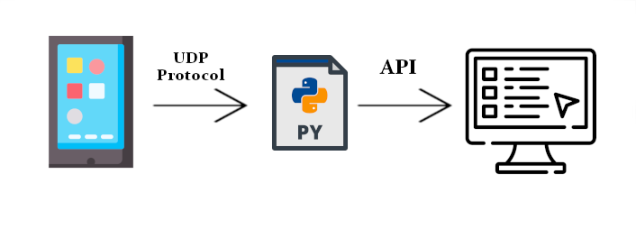

#### Android Application

We developed an Android application using Android Studio, which mainly uses Java to program the application's functionalities. We decided to build two remotes - one would be our novel remote, and another would be the conventional remote that we all are familiar with. For this, we created 3 GUIs - 2 for the two different types of remote, and 1 for the settings. So essentially, we have:

* Layout
* Remote
* Settings

We also make use of the APIs provided by Android though Java for accessing the data from gyroscope, accelerometer, and rotation vector sensors. Each of the 3 sensors have 3 values pertaining to x, y and z orientation.


##### Layout

The first tab is our novel proposed idea, called "Layout". It consists of 4 buttons covering the majority portion of the screen. The 4 buttons correspond to the 4 action units that we call as "Left screen", "Right screen", "Top screen" and "Bottom screen".

After having connected through the Settings tab to the Python server, the Android application enters into a streaming mode, wherein it continuously streams the data from gyroscope, accelerometer, and rotation vector sensors. But by default, the streaming is put on a conditional mode. The app will stream only as long as one of the 4 buttons are held pressed. As soon as any of the button is released, the streaming stops (but the connectivity remains).

The string that is sent from Android is of the following format:

```text
[timeStamp, buttonName,
 gyroX, gyroY, gyroZ,
 acceleroX, acceleroY, acceleroZ,
 rotX, rotY, rotZ]
```

##### Remote

The second tab is the typical "Remote", wherein we place the most common buttons on any remote like play, pause, volume up, down, etc. Pressing any of the buttons streams a static message identifying the specific button pressed.

In this case, the string that is sent from Android is of the following format:

```text
[actionName]
```

Where `actionName` is the action specific to the button pressed, for example "Play", "Stop", "Next", etc.

##### Settings

The third tab is the settings tab, wherein the user can specify the IP address of the computer the Android app would connect to. The port is always fixed to 50000 in the Python side, so it's not required to change it.

#### Python Application

For this application, there are dependencies that need to be included. Most of them are Python's out of the box dependencies, so they are already included. In addition to these libraries, the following list showcases the external libraries needed:

* [Pycaw](https://github.com/AndreMiras/pycaw) (Used to control the device's volume)
* [Keyboard](https://pypi.org/project/keyboard/) (Used to simulate keyboard actions)

##### Communication

To begin with, the communication is achieved by using a simple UDP protocol, which does not requires direct connection between the Android application and the Python backend. Instead the Android sends the data through a pre-defined port (default is 50000) in the same network. Then the Python backend is able to receive these data in its buffer and extract the information.

There are several messages that can exist in this communication channel. These messages describe the exact user's motion as well as the region of the screen pressed. The following table explains the different possibilities thoroughly.

|    Action     | Tilt up | Tilt Down | Tilt Left | Tilt Right |
|:--------------|:-------:|:---------:|:---------:|:----------:|
| Left screen   | LSTU    | LSTD      | LSTL      | LSTR       |
| Right screen  | RSTU    | RSTD      | RSTL      | RSTR       |
| Top screen    | TSTU    | TSTD      | TSTL      | TSTR       |
| Bottom screen | BSTU    | BSTD      | BSTL      | BSTR       |

##### Setting Configuration

This Python application supports saving and loading of custom settings, depending on the user's need. In more details, the user can choose the preferred action for each kind of gesture, and save the configuration. This configuration is later saved in separate file called `settings.json`. Additionally, when an action is received through the communication channel, it is checked against the existing setting configuration, and the appropriate action is executed.

##### Operations

When an action is triggered, the appropriate function is called based on the setting configuration. This behavior enables the application to be easily extended in order to support all kinds of external APIs for device manipulation. In this project we made use of the two libraries mentioned above to showcase this behavior, one being volume control and the other button presses.

## Experiments

### Objectives

During the conducted experiments, we were interested to identify and compare the differences in time between the most well-known and "traditional" remote control applications, versus our gestural interaction control. More specifically, we were interested in:

* Measuring the time difference between by continuously using both approaches.
* Identifying the time difference in a more natural way of using these approaches, like picking up the control device only when needed.
* Interest in finding out if there is learning over time of this new interaction.

### Experiment Sessions

The Python application contains a tab called **Interaction Testing**. This tab is where the experiments held place. The user interface of this tab looks like the following image:

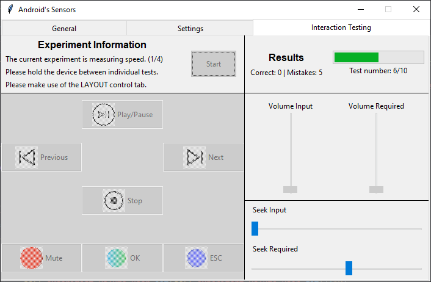

In this tab, there are buttons to be matched for the most common actions, that a remote application is used for, namely `Play/Pause`, `Next`, `Previous`, `Stop`, `Mute`, `OK` and `ESC`. In addition to these four bars are present, two for volume and two for the seeking actions. On of each set shows the required value that has to be matches, while the other shows the current user's value.

The experiments consist of two categories, namely *Speed Tests* and *Interaction Tests*. The purpose of the speed tests is to give an overall idea of the time difference required to do an action with each approach. This category requires the user to hold the Android device for the duration of this experiment. On the other hand, the interaction tests aim to extract information by a more natural way of using the two approaches. This category requires the user to leave the device down between each test. This aims to simulate the more common way of picking up the remote device to perform just a simple action. In total there are four sets of experiments run with the following order:

1. Speed test using the **Layout** tab
2. Speed test using the **Remote** tab
3. Interaction test using the **Layout** tab
4. Interaction test using the **Remote** tab

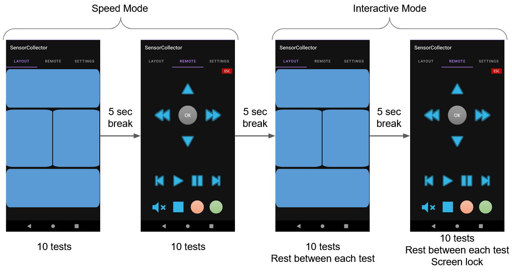

For our experiments 7 participants were involved. All of the participants had no prior knowledge on interactions similar to our approach. Before the actual experiments started, a demonstration was given on how it works, as well as explanation of the different experimental phases and sets of tests. From that point forward, the participants were told to start a new experiment session twice per day, in a span of five days.

### Post-experiments Survey

After the 5-day long experiment sessions, we asked our participants to answer and fill a quationare aiming for providing feedback. In particular, the user case study, aimed to identify the extend of the disadvantages of our approach (for example memorizing the gestures) as well as gathering insight on user opinions and suggestions.

## Results and Discussion

### Quantitative

In the first part of this section, the shown charts share information on the learning curve over the span of 5 days of conducting experiments, the percentage in speed increase of the various controls as well as the average correct answers per day. The second brings insight on the mistakes made by specific controls and afterwards groups them by region of the screen.

#### Learning Curve

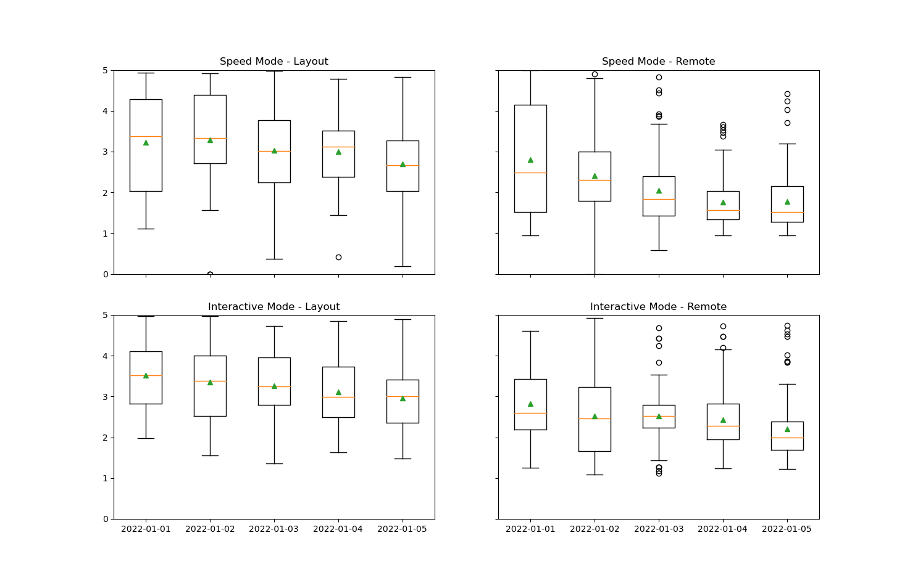

This box figure displays the range of values in time (seconds) for the five days that the experiments were conducted. Each of the plots displays a specific set of tests as explained above. Here, the green triangles represent the average time value for each day. Interestingly, both approaches and on all 4 sets of tests, the participants increased their response times to the required controls, proving the fact that they can improve with time. As shown in these figures the learning curve is decreasing over time.

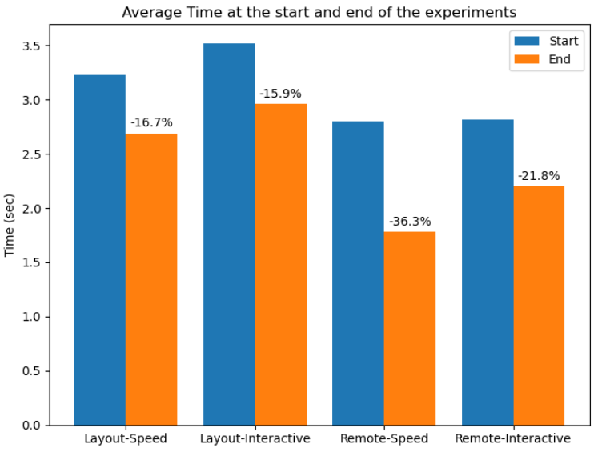

The previous figure displays the average times in seconds in the very first day of the experiments, and compares that time with the time in seconds during the last day. As mentioned earlier all aproaches were improved over time witht he highest improvement being by using the remote tab.

This can be explained, as the participants and in general remote-like applications exist already and we are all pretty accustomed to using them. Specifically the improvement comes from memorizing the various layouts, rather than learning how to use the application. On the other hand in the layout mode, the improvement comes from both memorizing the various motion gestures availiable as well as learning how to use the approach.

Following is a figure showing the average correct answers per day. As depicted and as expected the remote tab had almost perfect scores after 2 days, but the layout tab had the biggest improvement advancing from 4 correct answers in the first day to 8 in the end. We are pretty confident that should the experiments have run longer, this increasing trend could reach the same level as the remote tab.

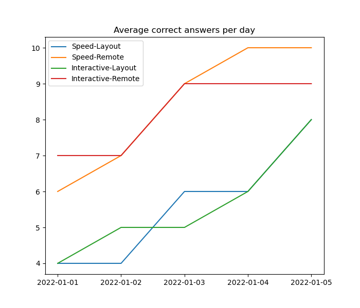

### Qualitative

We conducted a survey after the experiments were completed, which consisted of 4 questions about the usability of the approach, and 3 questions about users opinions. More specifically:

1. Usability
    1. How would you rate the difficulty to learn our new interaction? (Scale is 0-10 with 0 being easy)
    2. Do you think 4 options per area are a lot to remember?
    3. If the Android app was programmed to have been functioning in the background while in locked screen mode (screen turned-off), would you still be able to locate the 4 rectangles?
    4. Do you think that if you were allowed to change the settings to your liking, it would be easier to remember?
2. Opinions
    1. Do you think you could replace the standard remote-like applications to this one?
    2. What kind of applications would you like to control with this new gestural interaction?
    3. Any other suggestion/feedback you might have for the app?

#### Usability

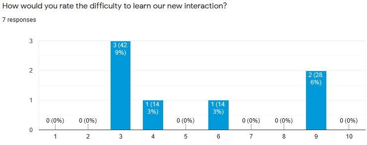

Most of the results on the difficulty level of our proposed approached were grouped between 3 an 4, thus making the general idea that this interaction is not "very hard" to learn and use.

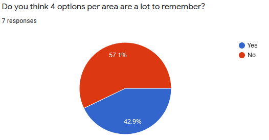

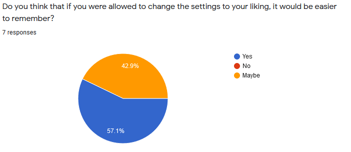

In the previous two figures the idea of the four different controls for each of the four regions of the screen is shown. In more details the majority of the participants thought that this combination of regions and controls per region is not hard to remember. Moreover, this fact can be reinforced by the idea of the custom setting configuration for the different areas, which all of the participants responded positively.

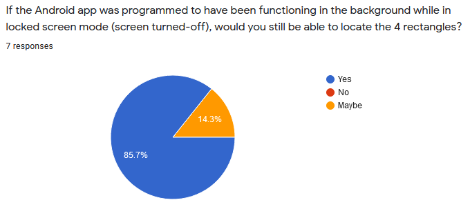

We had similar results when participants were asked whether they had the finished result (which is just a black screen instead of blue regions), would they still be able to identify the regions? All answers given were positive.

#### Opinions

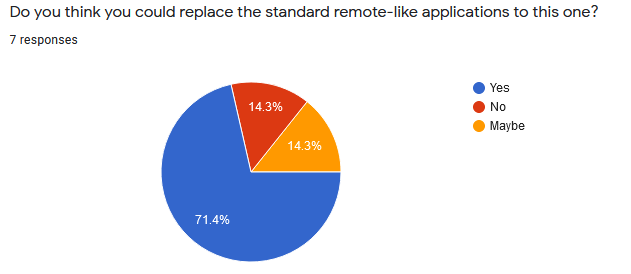

Over 70% of the participants stated that they could see themselves using this new gestural approach for day to day tasks, while only 14.3% replied with a negative answer. In addition to this, some of the suggested tasks that the participants could identify are the following:

* Video control
* Presentations
* Music control
* Smart home control (e.g smart lighting)
* CCTV control
* Robotics control

Last but not least, the following list shares some suggestions coming from the participants:

* It may seem difficult in the beginning but it's just a question of habit and has potential for many purposes.
* A very nice and helpful interaction with this layout tab could be the ability to control different devices by tapping on different parts of the screen.

## Conclusion
